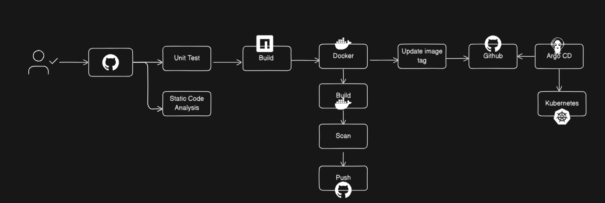

# DevSecOps Pipeline Implementation 

- **Project Overview**
- **Pipeline Stages**
- **Getting Started**
- **Upcoming changes**
- **Useful Links**


📌 **Project Overview**

This project is a Tic Tac Toe game developed using React 18 and TypeScript. It also serves as a demonstration platform for applying key security concepts through the integration of tools for Static Application Security Testing (SAST), Software Composition Analysis (SCA), Dynamic Application Security Testing (DAST),Argo CD, and Kubernetes .


🌟  **Pipeline Stages**

The CI/CD pipeline consists of the following stages:

1. **Unit Testing** - Runs the test suite using Vitest
2. **Static Code Analysis** - Performs linting with ESLint
3. **Build** - Creates a production build of the application
4. **Docker Image Creation** - Builds a Docker image using a multi-stage Dockerfile
5. **Docker Image Scan** - Scans the image for vulnerabilities using Trivy
6. **Docker Image Push** - Pushes the image to GitHub Container Registry
7. **Update Kubernetes Deployment** - Updates the Kubernetes deployment file with the new image tag




 🎯 **Getting Started:**

**Prerequisites:**

### 🔹 **Required GitHub Secrets**

Before running this workflow, add the following **secrets** in your GitHub repo (**Settings → Secrets → Actions**):

- YOUR_GITHUB_USERNAME  → Docker username
- YOUR_GITHUB_TOKEN → Docker password

🔹 **Run**

-Make any change (EX: change player name in file” ScoreBoard” )commit and push changes that will trigger the pipeline .

-Troubleshooting any issue generated at workflow runs like :

 a)Issue found unable to parse image name so i had to edit the docker image tag at two stages (Docker build and image scan) at ci-cd yaml file.

 b)Trivy results some vulnerabilities found while scan the docker image as mentioned below, so i had to edit the docker config file for new versions.

 https://github.com/MayadaAhmed1/Devsecops-pipeline/actions/runs/14303698830/job/40082794239


### 1) Implement Code Coverage

- Integrated test coverage using **Vitest**, with the necessary configuration added to the `vite.config.ts` file.
- Updated the CI/CD pipeline YAML file to include steps for installing coverage dependencies, executing tests with coverage, and generating reports.
- Integrated **Codecov** into the pipeline to visualize and monitor coverage statistics for each pipeline run.

📊 [View Codecov Dashboard](https://app.codecov.io/gh/MayadaAhmed1/Devsecops-pipeline)

### 2) **Software Composition Analysis (SCA) Integration**

- Integrated **Software Composition Analysis (SCA)** into the CI/CD pipeline to enhance visibility into third-party dependencies and manage supply chain risks.
- Utilized the [`cdxgen`](https://github.com/CycloneDX/cdxgen) GitHub Action to automatically generate a **Software Bill of Materials (SBOM)** as part of the pipeline execution.
- The pipeline was extended with a dedicated stage to:
    - Execute the `cdxgen` tool to scan the application and produce a CycloneDX-compliant SBOM.
    - Upload the resulting `bom.json` artifact to GitHub for traceability and compliance reporting.

📎 [CI/CD Run Example – SBOM Generation](https://github.com/MayadaAhmed1/Devsecops-pipeline/actions/runs/14427428542)

## 3) SonarQube Integration

### Deploying SonarQube on AWS EC2

To host a self-managed SonarQube server, an AWS EC2 instance is provisioned and configured using Docker. This provides a reliable environment for performing static code analysis and maintaining code quality across the development lifecycle.

### **EC2 Instance Configuration**

- **Instance Type**: `t2.medium` (2 vCPUs, 4 GiB memory)
- **Storage**: At least **20 GB** (recommended due to the resource-intensive nature of SonarQube and its embedded Elasticsearch)

> ⚠️ Note: Choosing a smaller instance may lead to instability or failure of the Elasticsearch component, resulting in service interruptions.
> 

### **Installation Steps**

1. **Install Docker** on the EC2 instance:
    
    ```bash
    sudo apt update && sudo apt install -y docker.io
    sudo systemctl enable docker
    sudo systemctl start docker
    ```
    
2. **Run the SonarQube container**:
    
    ```bash
    docker run -d --name sonar \
      -p 9000:9000 \
      sonarqube:lts-community
    ```
    
3. **Access the SonarQube dashboard** in your browser via:
    
    ```
    http://<EC2_PUBLIC_IP>:9000
    ```
    
    Replace `<EC2_PUBLIC_IP>` with the actual public IP address of your EC2 instance.
    

### Integrating SonarQube with GitHub Actions

Once SonarQube is operational, integrate it into your CI/CD pipeline by configuring a GitHub Actions workflow. This allows automated code analysis to be triggered with each push or pull request.

1. **Generate a SonarQube authentication token** from the web UI:
    - Go to **My Account** → **Security** → **Generate Tokens**
2. **Store the token securely** in your GitHub repository as a secret (e.g., `SONAR_TOKEN`).
3. **Update your GitHub Actions workflow** to include the SonarQube scanner step, referencing the self-hosted instance and token.
4. Run the pipeline by pushing the sonar new configuration ,check sonar dashboard it will show the run vulnerabilities status 

 


### 4) Enforce SonarQube Quality Gates

SonarQube Quality Gates used in maintaining code quality and enforcing organizational standards during the development lifecycle. A Quality Gate acts as a policy-driven checkpoint that evaluates whether a project meets predefined thresholds across a set of critical code health metrics.

These metrics typically include:

- **Reliability (Bugs)**
- **Security (Vulnerabilities, Security Hotspots)**
- **Maintainability (Code Smells)**
- **Coverage (Unit Test Coverage)**
- **Duplications**

During pipeline execution, SonarQube compares the results of the code analysis against the conditions defined in the active Quality Gate. If any threshold is not met, the gate fails, signaling that the code is not eligible for promotion to the next stage.

> ✅ A passed Quality Gate indicates the codebase is compliant with your organization's quality standards.
> 
> 
> ❌ A failed gate triggers a warning or blocks the pipeline (depending on your CI/CD configuration), prompting immediate remediation.
> 

This enforcement mechanism ensures that only high-quality, secure, and maintainable code moves forward in the delivery process.


```

### 📌 Upcoming Changes

- [x]  Add Code coverage ,SCA phase
- [x]  Add Sonar Qube and Quality gate phase
- [ ]  Add Dynamic phase(DAST)
- [ ]  Apply IAST


📚 **Useful Links:**

https://github.com/sottlmarek/DevSecOps?tab=readme-ov-file#oss-and-dependency-management

https://github.com/iam-veeramalla/devsecops-demo

https://www.youtube.com/watch?v=Ke_Wr5zPE0A&t=4047s

